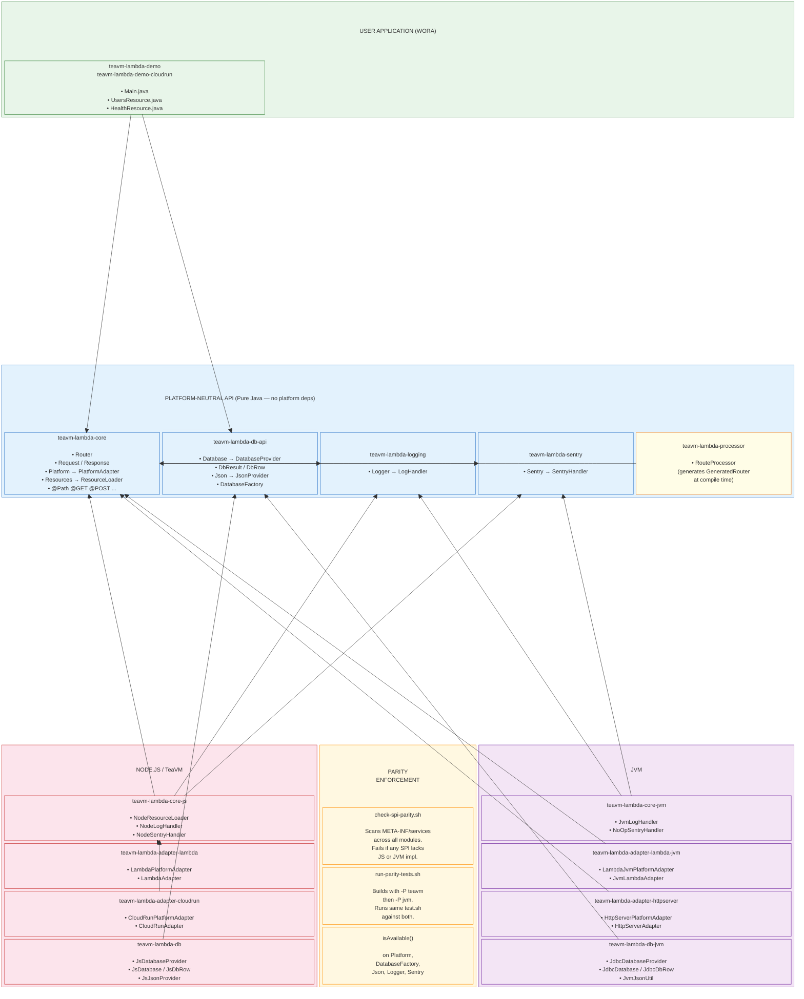

## Module-to-Layer Mapping

| Layer | Maven Module | Contents | Platform |
|-------|-------------|----------|----------|
| **User App** | `teavm-lambda-demo` | Main, UsersResource, HealthResource | WORA |
| **User App** | `teavm-lambda-demo-cloudrun` | Main, UsersResource, HealthResource | WORA |
| | | | |
| **API** | `teavm-lambda-core` | Router, Request, Response, Platform, Resources, annotations | Pure Java |
| **API** | `teavm-lambda-db-api` | Database, DbResult, DbRow, Json, DatabaseFactory | Pure Java |
| **API** | `teavm-lambda-logging` | Logger, LogHandler | Pure Java |
| **API** | `teavm-lambda-sentry` | Sentry, SentryHandler | Pure Java |
| **API** | `teavm-lambda-processor` | RouteProcessor (compile-time codegen) | Pure Java |
| | | | |
| **JS Impl** | `teavm-lambda-core-js` | NodeResourceLoader, NodeLogHandler, NodeSentryHandler | Node.js |
| **JS Impl** | `teavm-lambda-adapter-lambda` | LambdaPlatformAdapter, LambdaAdapter | Node.js |
| **JS Impl** | `teavm-lambda-adapter-cloudrun` | CloudRunPlatformAdapter, CloudRunAdapter | Node.js |
| **JS Impl** | `teavm-lambda-db` | JsDatabaseProvider, JsDatabase, JsJsonProvider | Node.js |
| | | | |
| **JVM Impl** | `teavm-lambda-core-jvm` | JvmLogHandler, NoOpSentryHandler | JVM |
| **JVM Impl** | `teavm-lambda-adapter-lambda-jvm` | LambdaJvmPlatformAdapter, JvmLambdaAdapter | JVM |
| **JVM Impl** | `teavm-lambda-adapter-httpserver` | HttpServerPlatformAdapter, HttpServerAdapter | JVM |
| **JVM Impl** | `teavm-lambda-db-jvm` | JdbcDatabaseProvider, JdbcDatabase, JvmJsonUtil | JVM |
| | | | |
| **Parity** | `check-spi-parity.sh` | Validates every SPI has both JS + JVM in META-INF/services | Build-time |
| **Parity** | `run-parity-tests.sh` | Runs same tests against both `-P teavm` and `-P jvm` builds | Test-time |
| **Parity** | `isAvailable()` on every factory | Runtime feature detection | Runtime |

## SPI Symmetry

Each concern follows the same pattern — API module defines interface + factory, impl modules register via `META-INF/services`:

| Concern | API Module | Factory | SPI Interface | JS Module | JVM Module |
|---------|-----------|---------|---------------|-----------|------------|
| Server | core | `Platform` | `PlatformAdapter` | adapter-lambda / adapter-cloudrun | adapter-lambda-jvm / adapter-httpserver |
| Database | db-api | `DatabaseFactory` | `DatabaseProvider` | db | db-jvm |
| JSON | db-api | `Json` | `JsonProvider` | db | db-jvm |
| Resources | core | `Resources` | `ResourceLoader` | core-js | (built-in fallback) |
| Logging | logging | `Logger` | `LogHandler` | core-js | core-jvm |
| Error tracking | sentry | `Sentry` | `SentryHandler` | core-js | core-jvm |
