```mermaid
classDiagram
    direction TB

    %% ═══════════════════════════════════════════════════════════
    %% USER APPLICATION LAYER (WORA - Write Once Run Anywhere)
    %% ═══════════════════════════════════════════════════════════

    namespace UserApplication {
        class Main {
            +main(String[] args)$
        }
        class UsersResource {
            -Database db
            +listUsers() Response
            +getUser(String id) Response
            +createUser(String body) Response
            +deleteUser(String id) Response
        }
        class HealthResource {
            +health() Response
        }
        class GeneratedRouter {
            +route(Request) Response
        }
    }

    %% ═══════════════════════════════════════════════════════════
    %% CORE API LAYER (Pure Java - no platform dependencies)
    %% ═══════════════════════════════════════════════════════════

    namespace Core {
        class Router {
            <<interface>>
            +route(Request) Response
        }
        class Request {
            +getMethod() String
            +getPath() String
            +getHeaders() Map
            +getQueryParams() Map
            +getBody() String
        }
        class Response {
            +ok(String)$ Response
            +status(int)$ Response
            +header(String, String) Response
            +body(String) Response
        }
        class Platform {
            +isAvailable()$ boolean
            +env(String)$ String
            +env(String, String)$ String
            +start(Router)$
        }
        class PlatformAdapter {
            <<interface>>
            +env(String) String
            +start(Router)
        }
        class ResourceLoader {
            <<interface>>
            +loadText(String) String
        }
        class Resources {
            +isAvailable()$ boolean
            +loadText(String)$ String
        }
    }

    namespace Logging {
        class Logger {
            +isAvailable()$ boolean
            +info(String)
            +warn(String)
            +error(String)
            +error(String, Throwable)
        }
        class LogHandler {
            <<interface>>
            +log(String level, String loggerName, String message, String contextJson)
        }
    }

    namespace ErrorTracking {
        class Sentry {
            +isAvailable()$ boolean
            +init(String dsn)$
            +captureException(Throwable)$
            +setTag(String, String)$
            +addBreadcrumb(String, String)$
        }
        class SentryHandler {
            <<interface>>
            +init(String, String)
            +captureError(String, String)
            +setTag(String, String)
        }
    }

    namespace CoreAnnotations {
        class Path {
            <<annotation>>
        }
        class GET {
            <<annotation>>
        }
        class POST {
            <<annotation>>
        }
        class PathParam {
            <<annotation>>
        }
        class Body {
            <<annotation>>
        }
    }

    %% ═══════════════════════════════════════════════════════════
    %% DATABASE API LAYER (Pure Java interfaces)
    %% ═══════════════════════════════════════════════════════════

    namespace DatabaseAPI {
        class Database {
            <<interface>>
            +query(String) DbResult
            +query(String, String...) DbResult
            +close()
        }
        class DbResult {
            <<interface>>
            +getRows() List~DbRow~
            +getRowCount() int
            +toJsonArray() String
        }
        class DbRow {
            <<interface>>
            +getString(String) String
            +getInt(String) int
            +getDouble(String) double
            +getBoolean(String) boolean
            +has(String) boolean
            +toJson() String
        }
        class DatabaseFactory {
            +isAvailable()$ boolean
            +create(String)$ Database
        }
        class DatabaseProvider {
            <<interface>>
            +create(String) Database
        }
        class Json {
            +isAvailable()$ boolean
            +parse(String)$ DbRow
        }
        class JsonProvider {
            <<interface>>
            +parse(String) DbRow
        }
    }

    %% ═══════════════════════════════════════════════════════════
    %% NODE.JS / TEAVM IMPLEMENTATIONS (left side)
    %% ═══════════════════════════════════════════════════════════

    namespace NodeJS_Lambda {
        class LambdaPlatformAdapter {
            +env(String) String
            +start(Router)
        }
        class LambdaAdapter {
            +start(Router)$
        }
    }

    namespace NodeJS_CloudRun {
        class CloudRunPlatformAdapter {
            +env(String) String
            +start(Router)
        }
        class CloudRunAdapter {
            +start(Router)$
        }
    }

    namespace NodeJS_DB {
        class JsDatabaseProvider {
            +create(String) Database
        }
        class JsDatabase {
            +query(String) DbResult
            +query(String, String...) DbResult
        }
        class JsDbResult {
            +getRows() List~DbRow~
            +getRowCount() int
        }
        class JsDbRow {
            +getString(String) String
            +toJson() String
        }
        class JsJsonProvider {
            +parse(String) DbRow
        }
    }

    namespace NodeJS_Core {
        class NodeResourceLoader {
            +loadText(String) String
            +install()$
        }
        class NodeLogHandler {
            +log(String, String, String, String)
        }
        class NodeSentryHandler {
            +init(String, String)
            +captureError(String, String)
        }
    }

    %% ═══════════════════════════════════════════════════════════
    %% JVM IMPLEMENTATIONS (right side)
    %% ═══════════════════════════════════════════════════════════

    namespace JVM_Lambda {
        class LambdaJvmPlatformAdapter {
            +env(String) String
            +start(Router)
        }
        class JvmLambdaAdapter {
            +handleRequest(APIGatewayProxyRequestEvent, Context)
        }
    }

    namespace JVM_HttpServer {
        class HttpServerPlatformAdapter {
            +env(String) String
            +start(Router)
        }
        class HttpServerAdapter {
            +start(Router)$
            +start(Router, int)$
        }
    }

    namespace JVM_DB {
        class JdbcDatabaseProvider {
            +create(String) Database
        }
        class JdbcDatabase {
            +query(String) DbResult
            +query(String, String...) DbResult
        }
        class JdbcDbResult {
            +getRows() List~DbRow~
            +getRowCount() int
        }
        class JdbcDbRow {
            +getString(String) String
            +toJson() String
        }
        class JvmJsonUtil {
            +parse(String) DbRow
        }
    }

    %% ═══════════════════════════════════════════════════════════
    %% JVM CROSS-CUTTING (core-jvm)

    namespace JVM_Core {
        class JvmLogHandler {
            +log(String, String, String, String)
        }
        class NoOpSentryHandler {
            +init(String, String)
            +captureError(String, String)
        }
    }

    %% COMPILE-TIME
    %% ═══════════════════════════════════════════════════════════

    namespace CompileTime {
        class RouteProcessor {
            <<annotation processor>>
            +process(Set, RoundEnvironment) boolean
        }
    }

    %% ═══════════════════════════════════════════════════════════
    %% RELATIONSHIPS
    %% ═══════════════════════════════════════════════════════════

    %% User app -> Core API
    Main --> Platform : env(), start()
    Main --> DatabaseFactory : create()
    Main --> GeneratedRouter : creates
    UsersResource --> Database : query()
    UsersResource --> DbResult
    UsersResource --> DbRow
    UsersResource --> Json : parse()
    GeneratedRouter ..|> Router

    %% Core internals
    Platform --> PlatformAdapter : delegates via ServiceLoader
    Resources --> ResourceLoader : delegates via ServiceLoader
    DatabaseFactory --> DatabaseProvider : delegates via ServiceLoader
    Json --> JsonProvider : delegates via ServiceLoader
    Logger --> LogHandler : delegates via ServiceLoader
    Sentry --> SentryHandler : delegates via ServiceLoader
    Database --> DbResult : returns
    DbResult --> DbRow : contains

    %% Annotation processor
    RouteProcessor ..> GeneratedRouter : generates at compile time
    RouteProcessor ..> Path : reads
    RouteProcessor ..> GET : reads

    %% Node.js implementations
    LambdaPlatformAdapter ..|> PlatformAdapter
    LambdaPlatformAdapter --> LambdaAdapter
    CloudRunPlatformAdapter ..|> PlatformAdapter
    CloudRunPlatformAdapter --> CloudRunAdapter
    JsDatabaseProvider ..|> DatabaseProvider
    JsDatabaseProvider --> JsDatabase
    JsDatabase ..|> Database
    JsDbResult ..|> DbResult
    JsDbRow ..|> DbRow
    JsJsonProvider ..|> JsonProvider
    NodeResourceLoader ..|> ResourceLoader
    NodeLogHandler ..|> LogHandler
    NodeSentryHandler ..|> SentryHandler

    %% JVM implementations
    LambdaJvmPlatformAdapter ..|> PlatformAdapter
    LambdaJvmPlatformAdapter --> JvmLambdaAdapter
    HttpServerPlatformAdapter ..|> PlatformAdapter
    HttpServerPlatformAdapter --> HttpServerAdapter
    JdbcDatabaseProvider ..|> DatabaseProvider
    JdbcDatabaseProvider --> JdbcDatabase
    JdbcDatabase ..|> Database
    JdbcDbResult ..|> DbResult
    JdbcDbRow ..|> DbRow
    JvmJsonUtil ..|> JsonProvider
    JvmLogHandler ..|> LogHandler
    NoOpSentryHandler ..|> SentryHandler

    %% ═══════════════════════════════════════════════════════════
    %% STYLING
    %% ═══════════════════════════════════════════════════════════

    style Main fill:#e8f5e9,stroke:#2e7d32
    style UsersResource fill:#e8f5e9,stroke:#2e7d32
    style HealthResource fill:#e8f5e9,stroke:#2e7d32
    style GeneratedRouter fill:#e8f5e9,stroke:#2e7d32

    style Router fill:#e3f2fd,stroke:#1565c0
    style Request fill:#e3f2fd,stroke:#1565c0
    style Response fill:#e3f2fd,stroke:#1565c0
    style Platform fill:#e3f2fd,stroke:#1565c0
    style PlatformAdapter fill:#e3f2fd,stroke:#1565c0
    style ResourceLoader fill:#e3f2fd,stroke:#1565c0
    style Resources fill:#e3f2fd,stroke:#1565c0
    style Path fill:#e3f2fd,stroke:#1565c0
    style GET fill:#e3f2fd,stroke:#1565c0
    style POST fill:#e3f2fd,stroke:#1565c0
    style PathParam fill:#e3f2fd,stroke:#1565c0
    style Body fill:#e3f2fd,stroke:#1565c0

    style Logger fill:#e3f2fd,stroke:#1565c0
    style LogHandler fill:#e3f2fd,stroke:#1565c0
    style Sentry fill:#e3f2fd,stroke:#1565c0
    style SentryHandler fill:#e3f2fd,stroke:#1565c0

    style Database fill:#fff3e0,stroke:#e65100
    style DbResult fill:#fff3e0,stroke:#e65100
    style DbRow fill:#fff3e0,stroke:#e65100
    style DatabaseFactory fill:#fff3e0,stroke:#e65100
    style DatabaseProvider fill:#fff3e0,stroke:#e65100
    style Json fill:#fff3e0,stroke:#e65100
    style JsonProvider fill:#fff3e0,stroke:#e65100

    style LambdaPlatformAdapter fill:#fce4ec,stroke:#c62828
    style LambdaAdapter fill:#fce4ec,stroke:#c62828
    style CloudRunPlatformAdapter fill:#fce4ec,stroke:#c62828
    style CloudRunAdapter fill:#fce4ec,stroke:#c62828
    style JsDatabaseProvider fill:#fce4ec,stroke:#c62828
    style JsDatabase fill:#fce4ec,stroke:#c62828
    style JsDbResult fill:#fce4ec,stroke:#c62828
    style JsDbRow fill:#fce4ec,stroke:#c62828
    style JsJsonProvider fill:#fce4ec,stroke:#c62828
    style NodeResourceLoader fill:#fce4ec,stroke:#c62828
    style NodeLogHandler fill:#fce4ec,stroke:#c62828
    style NodeSentryHandler fill:#fce4ec,stroke:#c62828

    style LambdaJvmPlatformAdapter fill:#f3e5f5,stroke:#6a1b9a
    style JvmLambdaAdapter fill:#f3e5f5,stroke:#6a1b9a
    style HttpServerPlatformAdapter fill:#f3e5f5,stroke:#6a1b9a
    style HttpServerAdapter fill:#f3e5f5,stroke:#6a1b9a
    style JdbcDatabaseProvider fill:#f3e5f5,stroke:#6a1b9a
    style JdbcDatabase fill:#f3e5f5,stroke:#6a1b9a
    style JdbcDbResult fill:#f3e5f5,stroke:#6a1b9a
    style JdbcDbRow fill:#f3e5f5,stroke:#6a1b9a
    style JvmJsonUtil fill:#f3e5f5,stroke:#6a1b9a
    style JvmLogHandler fill:#f3e5f5,stroke:#6a1b9a
    style NoOpSentryHandler fill:#f3e5f5,stroke:#6a1b9a

    style RouteProcessor fill:#fffde7,stroke:#f57f17
```

**Legend:**
- Green: User application code (WORA)
- Blue: Core API layer (pure Java, no platform deps)
- Orange: Database API layer (pure Java interfaces)
- Red: Node.js/TeaVM implementations
- Purple: JVM implementations
- Yellow: Compile-time annotation processor

**Key architectural points:**
- User code (green) only depends on interfaces (blue + orange) — never on implementations
- Six SPIs with ServiceLoader discovery: `Platform`, `DatabaseFactory`, `Json`, `Resources`, `Logger`, `Sentry`
- Every factory has `isAvailable()` for graceful feature detection at runtime
- Swapping platform = swapping Maven dependencies (red vs purple), zero code changes
- `check-spi-parity.sh` validates that every SPI has both JS and JVM implementations
- `run-parity-tests.sh` runs the same integration tests against both platform builds
- The annotation processor (yellow) generates `GeneratedRouter` at compile time from `@Path`/`@GET`/etc.
